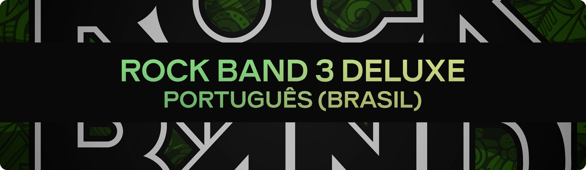

## About

This project is a complete fan translation of the Rock Band 3 Deluxe title to Brazilian Portuguese. On this repository, you'll find only `.dta` files to replace in your Rock Band 3 Deluxe build's `_ark` folder, replacing the original english locales to brazilian ones (since the game doesn't have a language detection that works for brazilian portuguese consoles). All texts were meticulously translated and replaced manually and revised in-game before any commit (unless when noted).

## Instalation

- Download/clone the Rock Band 3 Deluxe repository somewhere in your computer.
- Copy and paste the `_ark` folder from this repo, replacing the `_ark` folder of the Rock Band 3 Deluxe repository and all `.dta` files.
- Build the patch and install it on your console/emulator.

## Progress

- All menus are almost 100% translated.
- Deluxe options are almost 100% translated.
- Goals translation has already started.
- The Character Editor items and the Road Challenges hasn't been started yet.